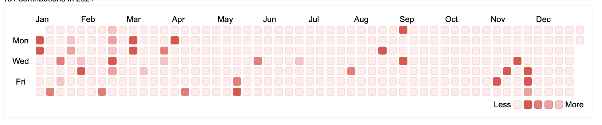

# GitHub Contribution Calendar


A simple and customizable GitHub contribution calendar built with React. Visualizes your contributions for a given year using a color-coded calendar.


## ✰ Key Features

- Displays a GitHub contribution calendar for a specific year.
- Customizable appearance (cell size, themes, labels, etc.).
- Shows total contributions for the year.
- Tooltips with contribution count on hover.

## ☁️ Installation and Usage

1. Install the package:

```bash
npm install github-contribution-calendar
```

2. Import and use the `GitHubCalendar` component

```javascript
import React from "react";
import { GitHubCalendar } from "github-contribution-calendar";

const App = () => (
  <div>
    <h1>My GitHub Contributions</h1>
    <GitHubCalendar
      username="github-username"
      token="YOUR_GITHUB_ACCESS_TOKEN"
      year={2024} // Optional: defaults to current year
      showLabels={true} // Optional
      fontSize={14} // Optional
      theme="forest" // Optional : defaults to "forest"
    />
  </div>
);

export default App;
```

## ⚙️ Available Properties

| Prop Name                | Type    | Default Value              | Description                                        |
| ------------------------ | ------- | -------------------------- | -------------------------------------------------- |
| `token`                  | string  | **Required**               | Your GitHub API access token.                      |
| `username`               | string  | **Required**               | The GitHub username to display contributions for.  |
| `year`                   | number  | `new Date().getFullYear()` | The year to display contributions for.             |
| `theme`   | string  | "forest"            | Themes or Custom colors for each contribution level.         |
| `cellSize`               | number/string  | `15`                       | Size of each calendar cell.                        |
| `showLabels`             | boolean | `true`                     | Whether to show month labels.                      |
| `background`             | string  | `"#ffffff"`                | Background color of the calendar.                  |
| `labelColor`             | string  | `"#000000"`                | Color for month labels.                            |
| `showTotalContributions` | boolean | `true`                     | Whether to show total contributions for the year.  |
| `fontSize`               | number/string  | `15`                       | Font size for total contributions text and labels. |
| `titleColor`             | string  | `"#000000"`                | Color for the title and total contributions text.  |

## 🎨 Themes

### Explore 12 Stunning Color Themes and 2 Fun Emoji Styles

1. Classic 


2. Aurora


3. Velvet


4. Forest


5. Crimson




6. Solar


7. Prism


8. Galaxy


9. Pastel


10. Monotone


11. Prison


12. Chocolate


13. Honeymoon


14. Minecraft


### Or Create your own Theme


``` javascript
import {GitHubCalendar} from "github-contribution-calendar"

function App() {
    const my_theme = {
        noContributions:"#F88379",
        low:"#FF6347",
        moderate:"##CD5700",
        high:"#A91101",
        veryHigh:"##7C3030"
    }

  return (
    <div className="App">
        <GitHubCalendar 
        username="github_username"
        token="YOUR_GITHUB_ACCESS_TOKEN" 
        theme="custom" // must be specified for custom theme to be applied 
        customTheme={my_theme}/>
    </div>
  );
}

export default App;
```


